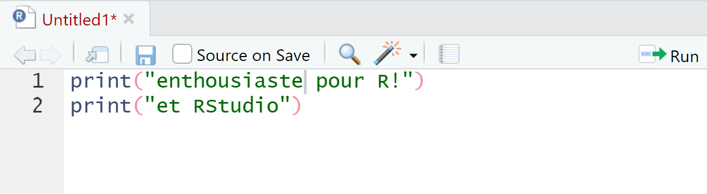
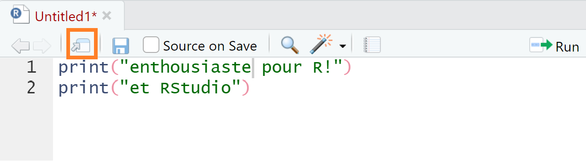

```{r echo = F, message = F, warning = F}
source(here::here("global/functions/misc_functions.R"))
knitr::opts_chunk$set(class.source = "tgc-code-block")
```

------------------------------------------------------------------------

# Objectifs d'apprentissage

1.  Vous pouvez identifier et utiliser les onglets suivants dans RStudio : Source, Console, Environment, History, Files, Plots, Packages, Help et Viewer

2.  Vous pouvez modifier les options d'interface de RStudio en fonction de vos besoins.

# Introduction

Maintenant que vous avez accès à R et RStudio, nous allons rapidement passer en revue l'interface de RStudio, votre maison numérique pour très longtemps.

Nous allons couvrir beaucoup de choses rapidement. Ne paniquez pas. On ne s'attend pas à ce que vous vous souveniez de tout cela. Au contraire, vous reverrez ces sujets encore et encore tout au long du cours, et vous les assimilerez naturellement de cette façon.

Vous pouvez également vous référer à cette leçon au fur et à mesure de votre progression.

Le but ici est simplement de vous faire connaître les outils à votre disposition au sein de RStudio.

------------------------------------------------------------------------

Pour commencer, vous devez ouvrir l'application RStudio :

-   Si vous travaillez avec RStudio Cloud, allez sur [rstudio.cloud](https://rstudio.cloud), connectez-vous, puis cliquez sur le projet "r_intro" que vous avez créé dans la dernière leçon. (Si vous ne le voyez pas, créez simplement un nouveau projet R en utilisant l'icône "New project" en haut à droite).

-   Si vous travaillez sur votre ordinateur local, allez dans votre dossier d'applications et double-cliquez sur l'icône RStudio. Vous pouvez également rechercher cette application dans le menu Démarrer (Windows) ou dans Spotlight (Mac).

# Les volets de RStudio

Par défaut, RStudio est organisé en quatre volets.

Si vous ne voyez que trois volets, ouvrez un nouveau script avec `File > New File > R Script` . Cela devrait faire apparaître un volet supplémentaire.

{width="451" height="71"}

Avant d'aller plus loin, nous allons réorganiser ces volets pour améliorer la convivialité de l'interface.

Pour ce faire, dans le menu RStudio en haut de l'écran, sélectionnez `Tools > Global Options` pour afficher les options de RStudio. Ensuite, sous `Pane Layout`, ajustez la disposition des volets. La disposition que nous recommandons est illustrée ci-dessous.

{width="403"}

Dans le volet supérieur gauche se trouve l'onglet Source et dans le volet supérieur droit, vous devriez avoir l'onglet Console.

Ensuite, dans le volet inférieur gauche, aucune option d'onglet ne doit être cochée --- cette section doit être laissée vide, la liste déroulante indiquant simplement "TabSet".

Enfin, dans le volet inférieur droit, vous devez cocher les onglets suivants : Environment, History, Files, Plots, Packages, Help et Viewer.

------------------------------------------------------------------------

Génial, vous devriez maintenant avoir une fenêtre RStudio qui ressemble à ceci :

{width="631"}

------------------------------------------------------------------------

Le volet supérieur gauche est l'endroit où vous ferez la plupart du codage. Agrandissez-le en cliquant sur son icône d'agrandissement :

{width="353"}

------------------------------------------------------------------------

Notez que vous pouvez faire glisser la barre qui sépare les volets de la fenêtre pour les redimensionner.

{width="231"}

------------------------------------------------------------------------

Examinons maintenant chacun des onglets de RStudio un par un. Vous trouverez ci-dessous une image récapitulative de ce dont nous allons discuter :


## Source/Éditeur

{width="469"}

La source ou l'éditeur est l'endroit où se trouvent vos "scripts" R. Un script est un document texte dans lequel vous écrivez et enregistrez du code.

Étant donné que c'est là que vous effectuerez la majeure partie de votre codage, il est important que vous disposiez de beaucoup d'espace visuel. C'est pourquoi nous avons réorganisé la disposition du volet RStudio ci-dessus --- afin de donner plus d'espace à l'éditeur.

Voyons maintenant comment utiliser cet éditeur.

------------------------------------------------------------------------

Tout d'abord, **ouvrez un nouveau script** dans le menu File si vous n'en avez pas encore ouvert un: `File > New File > R Script`. Dans le script, tapez ce qui suit :

```{r eval = F}
print("Bonjour R")
```

Pour **exécuter le code**, placez votre curseur n'importe où dans le code, puis appuyez sur "Commande" + "Entrée" sous macOS ou sur "Contrôle" + "Entrée" sous Windows.

Cela devrait envoyer le code à la console et l'exécuter.

------------------------------------------------------------------------

Vous pouvez également **exécuter plusieurs lignes à la fois**. Pour essayer cela, ajoutez une deuxième ligne à votre script, de sorte qu'il se lise maintenant comme suit :

```{r eval = F}
print("Bonjour R")
print("et RStudio!")
```

Faites maintenant glisser votre curseur pour mettre en surbrillance les deux lignes et appuyez sur `Commande`/`Contrôle` + `Entrée`.

Pour **exécuter le script entier**, vous pouvez utiliser `Commande`/`Contrôle` + `A` pour sélectionner tout le code, puis appuyez sur `Commande`/`Contrôle` + `Entrée`. Essayez ceci maintenant. Désélectionnez votre code, puis essayez le raccourci pour tout sélectionner.

::: remarque
Il y a aussi un bouton `Run` en haut à droite de l'onglet source ( {width="37"} ), qui permet d'exécuter le code (soit la ligne en cours, soit tout le code surligné). Mais vous devriez essayer d'utiliser le raccourci clavier à la place.
:::

------------------------------------------------------------------------

Pour **ouvrir le script dans une nouvelle fenêtre**, cliquez sur la troisième icône dans la barre d'outils directement au-dessus du script.

{width="329"}

Pour remettre la fenêtre en place, cliquez sur le même bouton sur la fenêtre désormais externe.

------------------------------------------------------------------------

Ensuite, **enregistrez le script.** Appuyez sur `Commande`/`Contrôle` + `S` pour faire apparaître la boîte de dialogue Enregistrer. Donnez-lui un nom de fichier comme "rstudio_intro".

-   Si vous travaillez avec RStudio Cloud, le fichier sera enregistré dans votre dossier de projet.

-   Si vous travaillez sur votre ordinateur local, enregistrez le fichier dans un endroit facile à localiser de votre ordinateur, par exemple votre bureau. (Plus tard, nous réfléchirons à la "bonne" façon d'organiser et de stocker les scripts).

------------------------------------------------------------------------

Vous pouvez **afficher des jeux de données** (qui sont comme des feuilles de calcul dans R) dans le même volet. Pour observer cela, saisissez et exécutez le code ci-dessous sur une nouvelle ligne de votre script :

```{r eval = F}
View(women)
```

Remarquez le "V" majuscule dans `View()`.

{width="234"}

`women` est le nom d'une trame de données chargé avec R. Il donne les tailles et poids moyens des femmes américaines âgées de 30 à 39 ans.

Vous pouvez cliquer sur l'icône "x" à droite de l'onglet "women" pour fermer ce visualiseur de données.

------------------------------------------------------------------------

## Console

La *console*, en bas à gauche, est l'endroit où le **code est exécuté**. Vous pouvez saisir le code directement ici, mais il ne sera pas enregistré.

Saisissez un bout de code au hazard (peut-être un calcul comme '3 + 3') et appuyez sur 'Entrée'.

{width="594"}

Si vous placez votre curseur sur la dernière ligne de la console et que vous appuyez sur la **flèche vers le haut**, vous pouvez revenir au dernier code exécuté. Continuez à appuyer dessus pour revenir aux lignes précédentes.

Pour exécuter l'une de ces lignes précédentes, appuyez sur *Entrée*.

## Environment

{width="527"}

En haut à droite de la fenêtre RStudio, vous devriez voir l'onglet **Environment**.

L'onglet Environment affiche les jeux de données et autres objets qui sont chargés dans la mémoire de travail de R, ou "espace de travail".

Pour explorer cet onglet, importons une trame de données dans votre environnement à partir du Web. Saisissez le code ci-dessous dans votre script et exécutez-le :

```{r eval = F}
ebola_data <- read.csv("https://tinyurl.com/ebola-data-sample")
```

::: remarque
Vous n'avez pas besoin de comprendre exactement ce que fait le code ci-dessus pour l'instant. Nous souhaitons simplement vous montrer rapidement les fonctionnalités de base de l'onglet Environment ; nous examinerons l'importation de données en détail plus tard.

De plus, si vous ne disposez pas d'un accès Internet actif, le code ci-dessus ne fonctionnera pas. Vous pouvez ignorer cette section et passer à l'onglet "History".
:::

Vous avez maintenant importé le jeu de données et l'avez stocké dans un *objet* nommé `ebola_data`. (Vous auriez pu nommer l'objet comme vous voulez.)

Maintenant que le jeu de données est stocké par R, vous devriez pouvoir le voir dans l'onglet Environment. Si vous cliquez sur l'icône déroulante bleue à côté du nom de l'objet dans l'onglet Environment, un résumé s'affiche.

{width="351"}

Essayez de cliquer directement sur le jeu de données `ebola_data` à partir l'onglet Environment. Cela l'ouvre dans un onglet "Viewer".

------------------------------------------------------------------------

Vous pouvez **supprimer un objet de l'espace de travail** avec la fonction `rm()`. Tapez et exécutez ce qui suit dans une nouvelle ligne de votre script R.

```{r eval = F}
rm(ebola_data)
```

Notez que l'objet `ebola_data` n'apparaît plus dans votre environnement après avoir exécuté ce code.

L'icône du balai, en haut de l'onglet Environment, peut également être utilisée pour nettoyer votre espace de travail.


Pour vous entraîner à l'utiliser, essayez de réexécuter la ligne ci-dessus qui importe le jeu de données Ebola, puis effacez l'objet à l'aide de l'icône en forme de balai.

## History

Ensuite, l'onglet **History** affiche les commandes précédentes que vous avez exécutées.

{width="470"}

Vous pouvez cliquer sur une ligne pour la mettre en surbrillance, puis l'envoyer à la console ou à votre script à l'aide des icônes "To Console" et "To Source" situées en haut de cet onglet.

Pour sélectionner plusieurs lignes, utilisez la méthode "Shift-clic": cliquez sur le premier élément que vous souhaitez sélectionner, puis maintenez la touche "Shift" enfoncée et cliquez sur le dernier élément que vous souhaitez sélectionner.

Enfin, vous remarquerez la présence d'une barre de recherche en haut à droite de l'onglet History, qui vous permet de rechercher les commandes passées que vous avez exécutées.

## Files

Ensuite, l'onglet **Files**. Il affiche les fichiers et les dossiers du dossier dans lequel vous travaillez.


Cet onglet vous permet d'interagir avec le système de fichiers de votre ordinateur.

Essayez de jouer avec certains des boutons ici, pour voir ce qu'ils font. Vous devriez au moins essayer les options suivantes :

-   Créer un nouveau dossier

-   Supprimer ce dossier

-   Créer un nouveau script R

-   Renommer ce script

## Plots

Ensuite, l'onglet **Plots**. C'est ici que les figures ou graphiques générées par R apparaîtront. Essayez de créer un graphique simple avec le code suivant :

```{r eval = F}
plot(women)
```


Ce code crée un graphique des deux variables dans le jeu de données "women". Vous devriez voir cette figure dans l'onglet Plots.

Maintenant, testez les boutons en haut de cet onglet pour explorer ce qu'ils font. En particulier, essayez d'exporter un graphique sur votre ordinateur.

## Packages

Regardons ensuite l'onglet **Packages**.

{width="419"}

Les packages sont des collections de code R qui étendent les fonctionnalités de R. Nous aborderons les packages en détail dans une prochaine leçon.

Pour l'instant, il est important de savoir que pour utiliser un package, vous devez l'*installer* puis le *charger*. Les packages ne doivent être installés qu'une seule fois, mais doivent être chargés à chaque nouvelle session R.

Tous les noms de packages que vous voyez (en police bleue) sont des packages installés sur votre système. Les packages cochés sont des packages qui sont *chargés* dans la session en cours.

Vous pouvez installer un package avec le bouton Install de l'onglet Packages.

{width="348"}

Mais il est préférable d'installer et de charger les packages avec le code R, plutôt qu'avec le bouton Install. Essayons ceci. Saisissez et exécutez le code ci-dessous pour installer le package {highcharter}.

```{r eval = F, message = F}
install.packages("highcharter")
library(highcharter)
```

La première ligne installe le package. La deuxième ligne *charge* le package depuis votre bibliothèque de packages.

Comme vous n'avez besoin d'installer un package qu'une seule fois, vous pouvez maintenant supprimer la ligne d'installation de votre script.

------------------------------------------------------------------------

Maintenant que le package {highcharter} a été installé et chargé, vous pouvez utiliser les fonctions qu'il contient. Pour essayer cela, saisissez et exécutez le code ci-dessous :

```{r}
highcharter::hchart(women$weight)
```

Ce code utilise la *fonction* `hchart()` du package {highcharter} pour tracer un histogramme interactif montrant la distribution des poids dans le jeu de données `women`.

(Bien sûr, vous ne savez peut-être pas encore ce qu'est une fonction. Nous y reviendrons bientôt.)

## Viewer

Notez que l'histogramme ci-dessus apparaît dans un onglet **Viewer**. Cet onglet vous permet de prévisualiser les fichiers HTML et les objets interactifs.

## Help

Enfin, l'onglet **Help** affiche la documentation des différents objets R. Essayez de taper et d'exécuter chaque ligne ci-dessous pour voir à quoi ressemble cette documentation.

```{r eval = F}
?hchart
?women
?read.csv
```

{width="451"}

Les fichiers d'aide ne sont pas toujours très faciles à comprendre pour les débutants, mais avec le temps, ils deviendront plus utiles.

#Options de RStudio

RStudio dispose d'un certain nombre d'options utiles pour modifier son apparence et ses fonctionnalités. Essayons-les. Il se peut que vous ne compreniez pas toutes les modifications apportées pour l'instant. Ce n'est pas grave.

Dans le menu RStudio en haut de l'écran, sélectionnez `Tools > Global Options` pour faire apparaître les options de RStudio.

-   Maintenant, sous "Appearence", choisissez votre thème idéal. (Nous aimons les thèmes "Crimson Editor" et "Tomorrow Night".)

    {width="530"}

-   Sous `Code > Display`, cochez "Highlight R function calls". Cela donne à vos *fonctions* R une couleur unique, améliorant ainsi la lisibilité. Vous comprendrez cela plus tard.

-   Toujours sous `Code > Display`, cochez "Rainbow parentheses". Cela rend vos "parenthèses imbriquées" plus faciles à lire en donnant à chaque paire une couleur unique.

    {width="446"}

    {width="460" height="66"}

    {width="361"}

-   Enfin, sous `General> Basic`, **décochez** la case indiquant **"Restaurer .RData dans l'espace de travail au démarrage"**. Vous ne souhaitez pas restaurer de données dans votre espace de travail (ou \* Environment)\* lorsque vous démarrez RStudio. Commencer avec un espace de travail propre à chaque fois est moins susceptible de conduire à des erreurs.

    Cela signifie également que vous ne voulez jamais **"enregistrer votre espace de travail dans .RData à la sortie"**, alors réglez-le sur **Jamais**.

# Palette de commandes

La palette de commandes Rstudio donne un accès instantané et consultable à de nombreuses options de menu et paramètres de RStudio que nous avons vus jusqu'à présent.

La palette peut être invoquée avec le raccourci clavier `Ctrl` + `Shift` + `P` (`Cmd` + `Shift` + `P` sur macOS).

Il est également disponible dans le menu *Tools* (*Tools* -\> *Show Command Palette*).

{width="527"}

Essayez de l'utiliser pour :

-   Créez un nouveau script (Recherchez "New script" et cliquez sur l'option appropriée)

-   Renommer un script (Recherchez "rename" et cliquez sur l'option appropriée)

# Conclusion

Toutes nos félicitations! Vous êtes maintenant un nouveau citoyen de RStudio.

Bien entendu, vous n'avez fait qu'effleurer la surface des fonctionnalités de RStudio. Au fur et à mesure que vous avancerez dans votre parcours R, vous découvrirez de nouvelles fonctionnalités et, nous l'espérons, vous aimerez de plus en plus ce merveilleux environnement de développement intégré (IDE) qu'est RStudio. Un bon point de départ est la fiche de contrôle officielle de l'IDE RStudio [cheatsheet](https://thegraphcourses.org/wp-content/uploads/2022/03/rstudio-IDE-cheatsheet.pdf).

Voici une section de cette fiche :


Rendez-vous dans la prochaine leçon!

# Autres ressources

1.  [23 trucs, astuces et raccourcis de RStudio](https://www.dataquest.io/blog/rstudio-tips-tricks-shortcuts/)

# Contributeurs {.unlisted .unnumbered}

Les membres de l'équipe suivants ont contribué à cette leçon :

`r tgc_contributors_list(ids = c("kendavidn", "ondieki","laure", "sabina"))`

# Références

Certains éléments de cette leçon ont été adaptés à partir des sources suivantes :

-   "Rstudio Cheatsheets." *RStudio*, <https://www.rstudio.com/resources/cheatsheets/.>
-   "Chapitre 1 Premiers pas : Compétences en matière de données pour une recherche reproductible." *Chapitre 1 Mise en route \| Compétences en données pour une recherche reproductible*, <https://psyteachr.github.io/reprores-v2/intro.html.>

`r tgc_license()`
