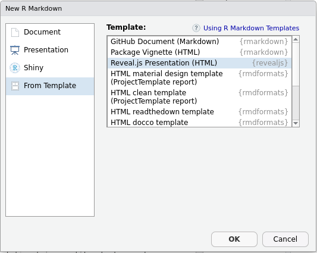

```{r, include = FALSE, warning = FALSE, message = FALSE}
# Charger les packages 
if(!require(pacman)) install.packages("pacman")
pacman::p_load(tidyverse, highcharter, here, htmltools)

# Fonctions sources
source(here("global/functions/misc_functions.R"))

# Paramètres knitr
knitr::opts_chunk$set(warning = F, message = F, class.source = "tgc-code-block", error = T)
```

# Introduction

Le package {rmarkdown} vous permet de générer dynamiquement des documents en mélangeant du texte formaté et des résultats produits par le code R. Les documents générés peuvent être en HTML, PDF, Word, et bien d'autres. C'est donc un outil très pratique pour exporter, communiquer et diffuser des résultats d'analyse.

Il existe un livre entier sur Rmarkdown, donc nous ne pouvons couvrir ici que quelques éléments essentiels.

Ce document a lui-même été généré à partir de fichiers R Markdown.

# Objectifs d'apprentissage {.unnumbered}

-   Vous pouvez créer et compiler un document Rmarkdown contenant du code et du texte libre.

-   Vous pouvez générer des documents dans de multiples formats incluant HTML, PDF, Word, Powerpoint et flexdashboards.

-   Vous comprenez la syntaxe de base de Markdown.

-   Vous pouvez utiliser les options de chunk R, incluant *eval*, *echo*, et *message*.

-   Vous connaissez la syntaxe pour le code R en ligne.

-   Vous reconnaissez quelques packages utiles pour la mise en forme de tableaux dans Rmarkdown.

-   Vous comprenez comment utiliser le package {here} pour forcer les fichiers Rmarkdown à utiliser le dossier du projet comme répertoire de travail.

# Configuration du projet

Dans RStudio, cliquez sur le menu *File*, puis sélectionnez *New project...*. Cliquez ensuite sur *New repository*. Donnez un nom à votre projet, et sélectionnez un répertoire dans lequel le placer. (Assurez-vous de vous souvenir de l'endroit vous l'avez mis !) Lorsque ces champs sont remplis, cliquez sur *Create Project*.

Ensuite, nous allons créer quelques dossiers à l'intérieur du projet. Allez dans l'onglet *Files*, et cliquez sur *New folder*. Nommez ce dossier "data", et cliquez sur *OK*. C'est ici que vous placerez les données relatives à ce projet. Créez un autre dossier nommé "rmd". Les documents R Markdown iront ici.

# Créer un nouveau document

Un document R Markdown est un simple fichier texte sauvegardé avec l'extension `.Rmd`.

Dans RStudio, vous pouvez créer un nouveau document en allant dans le menu *File* puis en choisissant *New file* puis *R Markdown...*. La première fois que vous créez un document R Markdown, il est possible que l'on vous demande d'installer plusieurs packages. Allez-y et installez ces packages. Une fois que RStudio a les packages appropriés, la boîte de dialogue suivante apparaît :

{width="355"}

Pour le moment, vous pouvez laisser toutes les valeurs par défaut et cliquer sur OK. Un fichier avec un contenu d'exemple est alors affiché.

Essayez de modifier une partie du texte dans le fichier. Notez qu'il est constitué de texte libre et de sections de code.

Enregistrez votre fichier avec `Cmd/Ctrl` + `S`, en vous rappelant de lui donner l'extension `.Rmd`. Par exemple "analyse_ebola.Rmd". Assurez-vous de le sauvegarder dans le dossier "rmd" que vous venez de créer.

Vous pouvez maintenant essayer de compiler le document en cliquant sur le bouton "knit" en haut à droite :

{width="271"}

Ceci va créer une sortie HTML qui ressemble à ceci :

{width="544"}

Ce nouveau fichier compilé est stocké dans le même répertoire que votre fichier Rmd. Il a le même nom, sauf qu'il se termine par ".html" au lieu de ".rmd".

::: vocabulaire
HTML signifie Hyper Text Markup Language et est le format utilisé pour la plupart des documents sur le web.
:::

# L'en-tête Rmarkdown (YAML)

Revenons maintenant au reste du Rmd pour l'examiner partie par partie.

La première partie du document est son \*en-tête\*. (Il est aussi appelé "YAML", ce qui signifie "Yet another markup language".) (Le nom se veut humoristique.)

```         
---
title: "Sans titre
output: html_document
date: "2022-10-09"
---
```

L'en-tête YAML doit être placé tout au début du document, délimité par trois tirets (`---`) avant et après.

Cet en-tête contient les métadonnées du document, comme son titre, son auteur, sa date, ainsi qu'une multitude d'options possibles qui vous permettront de configurer ou personnaliser l'ensemble du document et son rendu. Ici, par exemple, la ligne `output: html_document` indique que le document généré doit être au format HTML.

Nous pouvons modifier le texte `html_document` pour essayer d'autres formats.

Tout d'abord, vous pouvez faire ceci:

Avec la sortie fixée à "word_document", nous obtenons quelque chose comme ceci :


Notez que cela crée une version ".docx" de notre document dans le dossier "rmd".

Avec la sortie définie sur "powerpoint_presentation", cela donne ceci :


Si nous changeons le paramètre de sortie pour "pdf_document", nous pouvons obtenir le même document au format PDF (cela peut vous demander d'installer tinytex sur votre ordinateur, voir ci-dessous) :

{width="418"}

::: point-clé
Pour la génération de PDF, vous devez avoir une installation `LaTeX` fonctionnelle sur votre système. Sinon, l'extension `tinytex` de Yihui Xie vise à faciliter l'installation d'une distribution LaTeX minimale quel que soit le système d'exploitation de votre machine. Pour l'utiliser, vous devez d'abord installer l'extension avec `install.packages('tinytex')`, puis exécuter la commande suivante dans la console (attendez-vous à un téléchargement d'environ 200 Mo) : `tinytex::install_tinytex()` Plus d'informations sur [le site web de tinytex](https://yihui.name/tinytex/).
:::

Il existe également un format de fichier appelé "prettydoc". Pour l'essayer, saisissez `install.packages('prettydoc')` dans la console et appuyez sur *entrée*. Le format de sortie pour prettydoc est un peu différent des trois précédents que nous avons vus, vous devez saisir `prettydoc::html_pretty` dans la section `output`. Lorsque vous compilez un prettydoc, vous devriez voir quelque chose comme ceci :


Nous pouvons même obtenir un format de tableau de bord simple. Tout d'abord, nous devons `install.packages ('flexdashboard')`. Puis si nous définissons le `output` sur `flexdashboard::flex_dashboard`, et compilons, nous obtenons quelque chose comme ceci :


Notez qu'il n'a pas encore d'onglets. Pour créer des onglets dans un flexdashboard, changez certains de vos dièses doubles `##` en dièses simples `#`. Cela changera le style d'en-tête pour ces sections, et fera que flexdashboard les rende en tant qu'onglets au lieu de sous-titres.

De nombreux autres formats sont possibles, et nous vous encourageons à explorer par vous-même !

# Mode Visuel vs Source

Les documents Rmarkdown peuvent être édités soit en mode "Source" soit en mode "Visuel".

Vous pouvez passer en mode visuel pour un document donné à l'aide des barres d'outils. Pour les anciennes versions de RStudio, vous pouvez avoir un bouton `A` en haut à droite de la barre d'outils du document

{width="429"}

Pour les versions plus récentes de RStudio, il y a une paire de boutons pour basculer entre les modes :

{width="427"}

Quelle est la différence entre ces deux modes ?

En mode source, vous voyez la syntaxe brute de Markdown.

{width="416"}

::: vocabulaire
Markdown est un ensemble simple de conventions permettant d'ajouter de la mise en forme à du texte brut. Par exemple, pour mettre du texte en italique, vous l'enveloppez dans une astérisque `*texte ici*`, et pour commencer un nouvel en-tête, vous utilisez le signe dièse `#`. Nous allons apprendre ces éléments en détail ci-dessous.
:::

Mais en mode visuel, vous voyez plutôt une vue semblable à celle de Microsoft Word :

{width="444"}

avec une barre d'outils pour une mise en forme facile :

{width="544"}

Cela signifie que vous n'avez pas à vous souvenir de la syntaxe des éléments Markdown. Par exemple, si vous voulez mettre une section de texte en gras, vous pouvez simplement mettre en surbrillance cette partie de texte et cliquer sur le bouton "gras" dans la barre d'outils.

Maintenant, bien que le mode visuel soit beaucoup plus facile à utiliser, nous vous apprendrons ici la syntaxe Markdown pour trois raisons :

-   Le mode visuel est parfois une source de bugs, et pour déboguer cela, vous devrez passer en mode source

-   Comprendre la syntaxe Markdown est utile en dehors de Rmarkdown

-   Le mode visuel n'est pas disponible dans le mode collaboratif de RStudio, que vous pourriez être amené à utiliser

# Syntaxe Markdown

Dans l'onglet "Help", si vous recherchez "Markdown Quick Reference", vous pourrez trouver une large variété d'options RMD à votre disposition.

Vous pouvez définir des titres de différents niveaux en commençant une ligne avec un ou plusieurs `#` :

```         
# Titre de niveau 1
## Titre de niveau 2 
### Titre de niveau 3
```

Le corps du document est constitué de texte qui suit la syntaxe *Markdown*. Un fichier Markdown est un fichier texte qui contient des balises légères qui aident à définir les niveaux d'en-tête ou à mettre en forme du texte. Par exemple, le texte suivant :

```         
Ceci est du texte avec de *l'italique* et du **gras**.

Vous pouvez définir des listes à puces :

- premier élément
- deuxième élément
```

Va générer le texte formaté suivant :

> Ceci est du texte avec de *l'italique* et du **gras**.
>
> Vous pouvez définir des listes à puces :
>
> -   premier élément
> -   deuxième élément

Notez que vous avez besoin d'espaces avant et après les listes, ainsi que de garder les éléments énumérés sur des lignes séparées, sinon ils vont s'agglutiner ensemble au lieu de former une liste.

Nous voyons que les mots placés entre astérisques sont mis en italique, les lignes qui commencent par un tiret sont transformées en liste à puces, etc.

La syntaxe Markdown permet d'autres mises en forme, comme la possibilité d'insérer des liens ou des images. Par exemple, le code suivant :

```         
[Exemple de lien](https://example.com)
```

... donnera le lien suivant :

> [Exemple de lien](https://example.com)

Nous pouvons également intégrer des images. Si vous êtes en mode *Source*, tapez :

`[ce que vous voulez comme sous-titre](images/nom_image.jpg)`, en remplaçant "ce que vous voulez comme sous-titre" (ça peut aussi être vide), "images" par le nom du dossier d'images dans votre projet, et "nom_image.jpg" par le nom de l'image que vous voulez utiliser. Bien sûr, c'est plus facile à faire en mode *Visuel*. À partir de là, vous pouvez simplement ouvrir le dossier qui contient votre image sur votre ordinateur et faire glisser l'image du dossier sur la page que vous construisez. Ou vous pouvez placer le curseur là où vous voulez que l'image soit, cliquez sur le bouton marqué d'une icône "image", suivez les invites, et insérez votre image où se trouve le curseur. Notez que cela créera également un dossier "images" dans votre projet (s'il n'existe pas déjà) et mettra le fichier image dans le dossier "images".

Lorsque des titres ont été définis, si vous cliquez sur l'icône *Show document outline* complètement à droite de la barre d'outils associée au fichier R Markdown, une table des matières générée automatiquement à partir des titres est affichée et vous permet de naviguer facilement dans le document :


## Personnalisation du document généré

La personnalisation du document généré se fait en modifiant les options dans le préambule du document. Cependant, RStudio offre une petite interface graphique pour modifier ces options plus facilement. Pour cela, cliquez sur l'icône d'engrenage à droite du bouton *Knit* et choisissez *Output Options...*


Une boîte de dialogue apparaît vous permettant de sélectionner le format de sortie souhaité et, selon le format, différentes options :


Pour le format HTML par exemple, l'onglet *General* vous permet de spécifier si vous voulez une table des matières, sa profondeur, les thèmes à appliquer pour le document et la coloration syntaxique des blocs R, etc. L'onglet *Figures* permet de modifier les dimensions par défaut des graphiques générés.

Lorsque vous modifiez des options, RStudio modifiera en fait le préambule de votre document. Ainsi, si vous choisissez d'afficher une table des matières et de changer le thème de coloration syntaxique, votre en-tête deviendra quelque chose comme :

```         
---
title: "Révision R Markdown" 
output:
   html_document:
     highlight: kate
     knock: yes
---
```

Vous pouvez modifier les options directement en éditant le préambule.

Notez qu'il est possible de spécifier des options différentes selon le format, par exemple :

```         
---
title: "Révision R Markdown"
output:
  html_document:
    highlight: kate
    knock: yes
  pdf_document: 
    fig_caption: yes
    highlight: kate 
---
```

La liste complète des options possibles est présente sur [le site de documentation officiel](http://rmarkdown.rstudio.com/formats.html) (très complet et bien fait) ainsi que dans la fiche aide-mémoire et le guide de référence, accessibles depuis RStudio via le menu *Help* puis *Cheatsheets*.

# Blocs de code R

En plus du texte libre au format Markdown, un document R Markdown contient, comme son nom l'indique, du code R. Celui-ci est inclus dans des blocs (*chunks*) écrits de la façon suivante en mode *Source* :

```{r}
code_r <- 2+2 
```

Ce qui produira ce qui suit en mode *Visuel* :

```{r}
code_r <- 2+2
```

Comme cette séquence de caractères n'est pas très facile à saisir, vous pouvez utiliser le menu *Insert* de RStudio et choisir *R*[\^3], ou utiliser le raccourci clavier `Commande+Option+i` sur Mac ou `Ctrl+Alt+i` sur Windows.

Notez qu'il est possible d'utiliser d'autres langages dans les blocs de code.


Dans RStudio, les blocs de code R sont généralement affichés avec une couleur de fond légèrement différente pour les distinguer du reste du document.

Lorsque votre curseur est dans un bloc, vous pouvez saisir le code R que vous voulez et l'exécuter avec Commande + Entrée. Vous pouvez également exécuter tout le code contenu dans un bloc en cliquant sur le bouton vert "lecture" en haut à droite du bloc de code.

## Sortie de bloc en ligne vs dans la console

Dans RStudio, par défaut, les résultats d'un bloc de code (texte, tableau ou graphique) sont affichés directement *dans* la fenêtre d'édition du document, permettant de les visualiser et de les conserver facilement pendant la durée de la session.

Ce comportement peut être modifié en cliquant sur l'icône d'engrenage dans la barre d'outils et en choisissant *Chunk Output in Console*.

## Options de bloc de code R

Il est également possible de passer des options à chaque bloc de code R pour modifier son comportement.

Rappelez-vous qu'un bloc de code ressemble à ceci :

```{r echo = FALSE, comment = ""}
cat(
"```{r}
x <- 1:5")
```

Les options d'un bloc de code doivent être placées à l'intérieur des accolades `{r}`, avec une virgule séparant chaque option.

### Nom du bloc

La première possibilité est de donner un *nom* au bloc. Ceci est indiqué directement après le `r` :

`{r nom_bloc}`

Il n'est pas obligatoire de nommer un bloc, mais cela peut être utile en cas d'erreur de compilation, pour identifier le bloc qui a provoqué le problème. Attention, vous ne pouvez pas avoir deux blocs avec le même nom.

### Options

En plus d'un nom, un bloc peut se voir passer une série d'options sous la forme `option=valeur`. Voici un exemple de bloc avec un nom et des options :

```{r echo = FALSE, comment = ""}
cat(
"```{r NomBloc, echo = FALSE, warning = TRUE}
x <- 1:5")
```

Et un exemple de bloc sans nom avec des options :

```{r echo = FALSE, comment = ""}
cat(
"```{r echo = FALSE, warning = FALSE}
x <- 1:5")
```

L'une des options utiles est l'option `echo`. Par défaut `echo` vaut `TRUE`, et le bloc de code R est inséré dans le document généré, comme ceci :

```{r}
x <- 1:5
print(x)
```

Mais si on définit l'option `echo=FALSE`, alors le code R n'est plus inséré dans le document, et seul le résultat est visible :

```{r echo=FALSE}
x <- 1:5
print(x)
```

Voici une liste de certaines des options disponibles :

| Option  | Valeurs    | Description                                                                                                                   |
|------------------------|------------------------|------------------------|
| echo    | TRUE/FALSE | Afficher (ou masquer) ce bloc de code R dans le document compilé résultant                                                    |
| eval    | TRUE/FALSE | Exécuter (ou non) le code dans ce bloc de code dans le document compilé résultant                                             |
| include | TRUE/FALSE | Combiner les options "echo et eval" ; soit afficher et exécuter, soit masquer et ne pas exécuter                              |
| message | TRUE/FALSE | Afficher (ou masquer) tous les messages système générés par l'exécution de ce bloc de code dans le document compilé résultant |
| warning | TRUE/FALSE | Afficher (ou masquer) tous les avertissements générés par l'exécution de ce bloc de code dans le document compilé résultant   |

Il existe de nombreuses autres options décrites notamment dans le [guide de référence R Markdown](https://www.rstudio.com/wp-content/uploads/2015/03/rmarkdown-reference.pdf) (PDF en anglais).

### Modification des options

Il est possible de modifier les options manuellement en éditant l'en-tête du bloc de code, mais vous pouvez également utiliser une petite interface graphique proposée par RStudio. Pour cela, il suffit de cliquer sur l'icône d'engrenage située à droite de la ligne d'en-tête de chaque bloc :


Vous pouvez alors modifier les options les plus courantes, et cliquer sur *Apply* pour les appliquer.

### Options globales

Vous souhaiterez peut-être appliquer une option à tous les blocs d'un document. Par exemple, on peut vouloir par défaut ne pas afficher le code R de chaque bloc dans le document final.

Vous pouvez définir une option globalement en utilisant la fonction `knitr::opts_chunk$set()`. Par exemple, insérer `knitr::opts_chunk$set(echo = FALSE)` dans un bloc de code va définir l'option `echo = FALSE` par défaut pour tous les blocs suivants.

En général, nous plaçons toutes ces modifications globales dans un bloc spécial appelé `setup` qui est le premier bloc du document.

```{r echo=FALSE, comment=""}
cat(
"```{r, include=FALSE}
knitr::opts_chunk$set(echo = FALSE)
")
```

## Code entre les lignes

Il est également possible d'écrire des blocs de code intégrés dans le texte. Si vous allez en mode *Source* et que vous tapez [ \` ] avant et après:

"La somme d'une paire de 2 est `r 2+2`"

et que vous compilez le RMD, le document résultant évaluera le code R entre les " \` ". Notez que vous devez inclure le "r" au début de votre bloc de code entre les lignes pour qu'il le reconnaisse comme du code R.

Vous pourriez également passer des variables dans votre document comme dans un programme R normal. Par exemple, sur une ligne vous pourriez exécuter :

```{r}
taille_max <- max(women$height)
```

"La taille maximale dans le jeu de données women est `r taille_max`."

Les avantages d'un tel système sont nombreux :

-   un seul document peut montrer l'ensemble de votre flux d'analyse, puisque le code, les résultats et les explications textuelles sont inclus

-   le document peut être très facilement regénéré et mis à jour, par exemple si les données sources ont été modifiées.

-   la variété des formats de sortie (HTML, PDF, Word, diapositives, tableaux de bord, etc.) facilite la présentation de votre travail à d'autres personnes.

## Affichage des tableaux

Les documents R Markdown peuvent afficher des tableaux de données de différentes manières. Pour commencer, vous pouvez voir comment notre RMD affiche un tableau sans mise en forme :

```{r}
women
```

Il a l'air assez basique. Ensuite, pour suivre, vous devrez charger les packages suivants :

```{r}
pacman::p_load(flextable, gt, reactable)
```

Flextable est mieux pour afficher des tableaux simples pris en charge par de nombreux formats. GT est mieux pour afficher des tableaux complexes dans des documents HTML. Reactable est plus adapté à l'affichage de très grands tableaux en HTML en donnant à votre public la possibilité de faire défiler les tableaux.

```{r}
# Ceci est un tableau flextable 
flextable::flextable(women)
```

```{r}
# Ceci est un tableau GT
gt::gt(women)
```

```{r}
# Ceci est un tableau reactable
reactable::reactable(women)
```

Vous pouvez voir de nombreux autres types de formats de tableau que les gens ont créés sur <https://www.rstudio.com/blog/rstudio-table-contest-2022/>

## Modèles de documents {#templates}

Nous avons vu ici la production de documents "classiques", mais R Markdown vous permet de créer de nombreuses autres choses.

Le site de documentation de l'extension propose [une galerie](http://rmarkdown.rstudio.com/gallery.html) des différentes sorties possibles. Vous pouvez créer des diaporamas, des sites web ou même des livres entiers, comme ce document.

### Diapositives

Un usage intéressant est la création de diaporamas pour des présentations sous forme de diapositives. Le principe reste le même : nous mélangeons du texte au format Markdown et du code R, et R Markdown transforme le tout en présentations au format HTML ou PDF. En général, les différentes diapositives sont séparées à certains niveaux de titres.

Certains modèles de diapositives sont inclus dans R Markdown, notamment :

-   `ioslides` et `Slidy` pour les présentations HTML
-   `beamer` pour les présentations PDF via `LaTeX`

Lorsque vous créez un nouveau document dans RStudio, ces modèles sont accessibles via l'entrée *Presentation* :


D'autres extensions, qui doivent être installées séparément, permettent également de réaliser des diaporamas dans divers formats. Il s'agit notamment de :

-   [xaringan](https://slides.yihui.name/xaringan/%20for) pour les présentations HTML basées sur [remark.js](https://remarkjs.com/)
-   [revealjs](https://github.com/rstudio/revealjs) pour les présentations HTML basées sur [reveal.js](http://lab.hakim.se/reveal-js/#/)
-   [rmdshower](https://github.com/mangothecat/rmdshower) pour les diaporamas HTML basés sur [shower](https://github.com/shower/shower)

Une fois l'extension installée, elle offre généralement un *modèle* de départ lors de la création d'un nouveau document dans RStudio. Ceux-ci sont accessibles à partir de l'entrée *From Template*.



### Modèles

Il existe également différents *modèles* vous permettant de changer le format et la présentation des documents générés. Une liste de ces formats et leur documentation associée est disponible sur la page de documentation [formats](http://rmarkdown.rstudio.com/formats.html).

Notez en particulier :

-   le format [Distill](https://rstudio.github.io/distill/), adapté aux publications scientifiques ou techniques sur le Web
-   le format [Tufte Handouts](http://rmarkdown.rstudio.com/tufte_handout_format.html) qui permet de produire des documents PDF ou HTML dans un format similaire à celui utilisé par Edward Tufte pour certaines de ses publications
-   [rticles](https://github.com/rstudio/rticles), package qui propose des modèles LaTeX pour plusieurs revues scientifiques.

Enfin, l'extension [rmdformats](https://github.com/juba/rmdformats) propose plusieurs modèles HTML particulièrement adaptés pour les documents longs.

Là encore, la plupart du temps, ces modèles de documents offrent un modèle de départ lors de la création d'un nouveau document dans RStudio (entrée *From Template*) :


## Ressources

Les ressources suivantes sont toutes en anglais...

Le livre *R for data science*, disponible en ligne, contient [un chapitre dédié à R Markdown](http://r4ds.had.co.nz/r-markdown.html).

[Le site officiel de l'extension](http://rmarkdown.rstudio.com/) contient une documentation très complète, tant pour les débutants que pour les utilisateurs avancés.

Enfin, l'aide de RStudio (menu *Help* puis *Cheatsheets*) donne accès à deux documents de synthèse : une "fiche de triche" synthétique (*R Markdown Cheat Sheet*) et un "guide de référence" plus complet (*R Markdown Reference Guide*).
