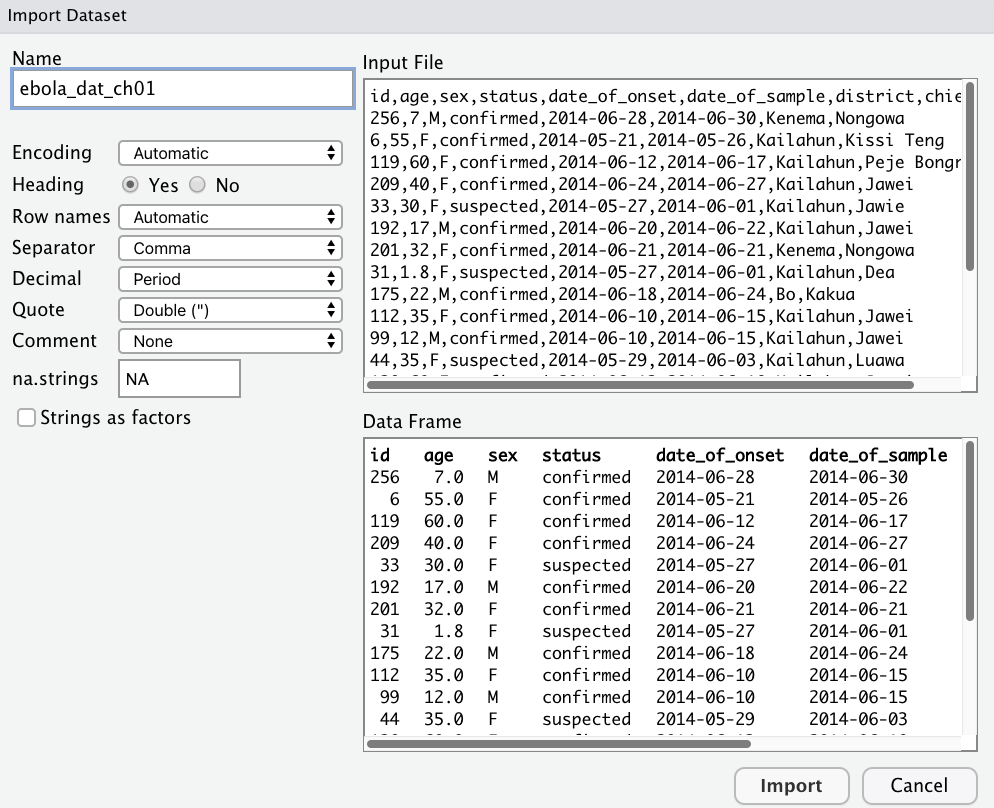
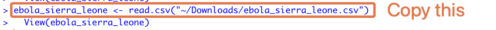

```{r, include = FALSE, warning = FALSE, message = FALSE}
# Load packages
if (!require(pacman)) install.packages("pacman")
pacman::p_load(tidyverse, knitr, here)

knitr::opts_chunk$set(warning = F, message = F, class.source = "tgc-code-block", error = T)

# Source functions
source(here("global/functions/misc_functions.R"))

# We secretly import the dataset from the data_prep folder
ebola_sierra_leone <- read_csv("/Users/kendavidn/Dropbox/graph_courses/course_projects/intro-to-data-analysis-with-r-staging/ch01_getting_started/data_prep/ebola_sierra_leone.csv")
```

# Getting started: Data dive---Ebola in Sierra Leone

## Learning objectives

1.  You can use RStudio's graphic user interface to import CSV data into R.

2.  You can explain the concept of reproducibility.

3.  You can use the `nrow()`, `ncol()` and `dim()` functions to get the dimensions of a dataset, and the `summary()` function to get a summary of the dataset's variables.

4.  You can use `vis_dat()`, `inspect_num()` and `inspect_cat()` to obtain visual summaries of a dataset.

5.  You can inspect a numeric variable:

    -   with the summary functions `mean()` , `median()`, `max()`, `min()`, `length()` and `sum()`;

    -   with esquisse-generated ggplot2 code.

6.  You can inspect a categorical variable:

    -   with the summary functions `table()` and `janitor::tabyl()`;

    -   with the graphical functions `barplot()` and `pie()`.

## Introduction

With your newly-acquired knowledge of functions and objects, you now have the basic building blocks required to do simple data analysis in R. So let's get started. The goal is to start working with data as quickly as possible, even before you feel ready.

Here you will analyze a dataset of confirmed and suspected cases of Ebola hemorrhagic fever in Sierra Leone in May and June of 2014 (Fang et al., 2016). The data is shown below:

```{r render = reactable_10_rows, echo = F}
ebola_sierra_leone
```

You will import and explore this dataset, then use R to answer the following questions about the outbreak:

-   **\
    When was the first case reported?**
-   **What was the median age of those affected?**
-   **Had there been more cases in men or women?**
-   **What district had had the most reported cases?**
-   **By the end of June 2014, was the outbreak growing or receding?**

## Script setup

<!-- TODO: Mention to restart. -->

First, open a new script in RStudio with `File > New File > R Script`.

{width="481"}

Next, save the script with `File > Save As` or press `Command`/`Control` + `S` to bring up the Save File dialog box. Save the file with the name "ebola_analysis" or something similar

### Header

Add a title, name and date to the start of the script, as code comments. This is generally good practice for writing R scripts. Your header may look like this:

```{r eval = F}
# Ebola Sierra Leone analysis
# John Sample-Name Doe
# 2024-01-01
```

You should update the name and the date to your name and the actual date of preparation of the script.

@TO-DO, Name is helpful for other people looking at the script. The date is helpful

@TO-DO, Year month day

### Packages

Next, use the `p_load()` function from {pacman} to load the packages you will be using. Put this under a section header called "Load packages", with four hyphens, as shown below:

```{r}
# Load packages ----
if(!require(pacman)) install.packages("pacman")
pacman::p_load(
  tidyverse, # meta-package
  inspectdf,
  plotly,
  janitor,
  visdat,
  esquisse
)
```

::: reminder
Remember that the *full signifier* of a function includes both the package name and the function name, `package::function()`. This full signifier is handy if you want to use a function before you have loaded its source package. This is the case in the code chunk above: we want use `p_load()` from {pacman} without formally loading the {pacman} package, so we type `pacman::p_load()`

We could also first load {pacman} before using the p_load function:

```{r eval = F}
library(pacman) # first load {pacman}
p_load(tidyverse) # use `p_load` from {pacman} to load other packages
```

(Also recall that the benefit of `p_load()` is that it automatically installs a package if it is not yet installed. Without `p_load()`, you have to first install the package with `install.packages()` before you can load it with `library()`.)
:::

## Importing data into R

Now that the needed packages are loaded, you should import the dataset.

Go to [bit.ly/view-ebola-data](https://bit.ly/view-ebola-data) to view the dataset you will be working on. Then click the download icon at the top to download it to your computer.

<!-- TODO Explain about the variables. -->

Comes from the a paper analyzing the transmission dynamics of Ebola virus disease. To view the help, go here: [bit.ly/ebola-data-source](https://bit.ly/ebola-data-source)

Or search the following on DOI.org if that link has expired.

\# 10.1073/pnas.1518587113

{width="674"}

You can leave the dataset in your downloads folder, or move it to somewhere more respectable; the upcoming steps will work independent of where the data is stored. In the next lesson, you will learn how to organize your data analysis projects properly, and we will think about the ideal folder setup for storing data.

------------------------------------------------------------------------

::: rstudio-cloud
NOTE: If you are using RStudio Cloud, you need to upload your dataset to the cloud. Do this in the "Files" tab by clicking on the "Upload" button.

{width="500"}
:::

------------------------------------------------------------------------

@TO-Do change to readr

Next, on the RStudio menu, go to `File > Import Dataset > From Text (readr)`.

{width="507"}

Browse through the computer's files and navigate to the downloaded dataset. Click to open it. You should see an import dialog box like this:

<!-- TODO: Update name of dataset in screenshot. -->

{width="507"}

Leave all the import settings at the default values. Just click on "Import" at the bottom, and voila, you should have the dataset loaded into R! You can tell this by looking at your environment pane, which should now feature an object called "ebola_sierra_leone" or something similar:

{width="507"}

RStudio should also have called the `View()` function on your dataset, so you should see a familiar spreadsheet view of this data:

{width="504"}

Now take a look at your console. Do you observe that your actions in the graphical user interface actually triggered some R code to be run? Copy the first part of this code, leaving out the `>` symbol.

{width="613"}

Paste the copied code into your R script, and label this section "Load data".

In your script, you should also replace the `read.csv()` function with `read_csv()`. `read.csv()` (with a period) is from R's preinstalled {utils} package for data importing, while `read_csv()` (with an underscore) is a newer function from the tidyverse, specifically the {readr} package. This latter function, `read_csv()`, is faster and is better in other ways you will see soon.

Now, you should have something like this in your script:

```{r eval = F}
# Load data ----
ebola_sierra_leone <- read_csv("~/Downloads/ebola_sierra_leone.csv")
```

::: recap
Nice work so far!

Your R script should look similar to this:

```{r eval = F}
# Ebola Sierra Leone analysis
# John Sample-Name Doe
# 2024-01-01

# Load packages ----
if(!require(pacman)) install.packages("pacman")
pacman::p_load(
  tidyverse,
  inspectdf,
  plotly,
  janitor,
  visdat
)

# Load data ----
ebola_sierra_leone <- read_csv("~/Downloads/ebola_sierra_leone.csv")
```
:::

## Intro to reproducibility

Now that the code for importing data is in your R script, you can easily rerun this script anytime to reimport the dataset; there will be no need to redo the manual point-and-click procedure for data import.

Try restarting R and rerunning the script now. Save your script with `Control/Command` + `s` , then *restart* R with the RStudio Menu, at `Session > Restart R`. On RStudio Cloud, the menu option looks like this:

{width="204"}

If restarting is successful, your console should print this message:

{width="485"}

You should also see the phrase "Environment is empty" in the Environment tab, indicating that the dataset you imported is no longer stored by R---you are starting with a fresh workspace.

{width="481"}

To re-run your script, use `Command/Control` + `a` to highlight all the code, then `Command/Control` + `Enter` to run it.

If this worked, congratulations; you have the beginnings of your first "reproducible" analysis script!

::: vocab
**What does "reproducible" mean?**

When you do things with code rather than by pointing and clicking, it is easy for anyone to re-run, or *reproduce* these steps, by simply re-running your script.

While you can use RStudio's graphical user interface to point-and-click your way through the data import process, you should always copy the relevant code to your script so that your script remains a reproducible record of all your analysis steps.

Of course, your script so far is not yet *entirely* reproducible, because the file path for the dataset (the one that looks like this: "...intro-to-data-analysis-with-r/ch01_getting_started/data...") is specific to just your computer. Later on we will see how to use relative file paths, so that the code for importing data can work on anyone's computer.
:::

::: watch-out
If your environment was not empty after restarting R, it means you skipped a step in a previous lesson. Do this now:

-   In the RStudio Menu, go to `Tools > Global Options` to bring up RStudio's options dialog box.

-   Then go to `General > Basic`, and **uncheck** the box that says "Restore .RData into workspace at startup".

-   For the option, "save your workspace to .RData on exit", set this to "Never".

    {width="542"}
:::

## Quick data exploration

Now let's walk through some basic steps of data exploration---taking a broad, bird's eye look at the dataset. You should type up this section under a heading like "Explore data" in your script.

To view the top and bottom 6 rows of the dataset, you can use the `head()` and `tail()` functions:

```{r}
# Explore data ----
head(ebola_sierra_leone)
tail(ebola_sierra_leone)
```

TO DO:

To view the whole dataset, use the `View()` function.

```{r eval = F}
View(ebola_sierra_leone)
```

This will again open a familiar spreadsheet view of the data:

{width="504"}

`nrow()`, `ncol()` and `dim()` give you the dimensions of your dataset:

```{r}
nrow(ebola_sierra_leone) # number of rows
ncol(ebola_sierra_leone) # number of columns
dim(ebola_sierra_leone) # number of rows and columns
```

::: reminder
If you're not sure what a function does, remember that you can get function help with the question mark symbol. For example, to get help on the `ncol()` function, run:

```{r}
?ncol
```
:::

------------------------------------------------------------------------

Another often-helpful function is `summary()`:

```{r}
summary(ebola_sierra_leone)
```

As you can see, for numeric columns in your dataset, `summary()` gives you the minimum value, the maximum value, the mean, median and the 1st and 3rd [quartiles](https://www.mathsisfun.com/data/quartiles.html).

For character columns it gives you just the length of the column (the number of rows), the "class" and the "mode". We will discuss what "class" and "mode" mean later.

### `vis_dat()`

The `vis_dat()` function from the {visdat} package is a wonderful way to quickly visualize the data types and the missing values in a dataset. Try this now:

```{r dpi = 350}
vis_dat(ebola_sierra_leone)
```

From this figure, you can quickly see the character, date and numeric data types, and you can note that age is missing for some cases.

::: watch-out
@TO-DO: remove this! If the variables `date_of_onset` and `date_of_sample`, don't show up as "Date" types in your `vis_dat()` output, it probably means you imported the dataset with the `read.csv()` function (with a period), instead of `read_csv()`(with an underscore). One benefit of `read_csv()` from {readr} is that it auto-detects date variables, telling R that they are dates. The standard `read.csv()` function does not do this, so date variables may appear as regular [character](https://psyteachr.github.io/glossary/c.html?q=character#character) variables.
:::

### `inspect_cat()` and `inspect_num()`

Next, `inspect_cat()` and `inspect_num()` from the {inspectdf} package produce nice visual summaries of the distribution of variables (columns) in the dataset.

If you run `inspect_cat()` on the data object, you get a tabular summary of the [categorical](https://psyteachr.github.io/glossary/c.html?q=categor#categorical) variables in the dataset, with some information hidden in the `levels` column (later you will learn how to extract this information).

```{r}
inspect_cat(ebola_sierra_leone)
```

But the magic happens when you run `show_plot()` on the result from `inspect_cat()`:

```{r}
# store the output of `inspect_cat()` in `cat_summary`
cat_summary <- inspect_cat(ebola_sierra_leone)

# call the `show_plot()` function on that summmary.
show_plot(cat_summary)
```

<!-- \@TODO: reminder of shortcut for assignment -->

You get a wonderful figure showing the distribution of all categorical and date variables!

::: side-note
You could also run:

```{r}
show_plot(inspect_cat(ebola_sierra_leone))
```
:::

From this plot, you can quickly tell that most cases are in Kailahun, and that there are more cases in women than in men ("F" stands for "female").

One problem is that in this plot, the smaller categories are not labelled. So, for example, we are not sure what value is represented by the white section for "status" at the bottom right. To see labels on these smaller categories, you can turn this into an interactive plot with the `ggplotly()` function from the {plotly} package.

```{r eval = F}
cat_summary_plot <- show_plot(cat_summary)
ggplotly(cat_summary_plot)
```

Wonderful! Now you can hover over each of the bars to see the proportion of each bar section. For example you can now tell that 9% (0.090) of the cases have a suspected status:

{width="656"}

------------------------------------------------------------------------

You can obtain a similar plot for the numerical (continuous) variables in the dataset with `inspect_num()`. Here, we show all three steps in one go.

```{r eval = F}
num_summary <- inspect_num(ebola_sierra_leone)
num_summary_plot <- show_plot(num_summary)
ggplotly(num_summary_plot)
```

This gives you an overview of the numerical columns, `age` and `id`. (Of course, the distribution of the `id` variable is not meaningful.)

You can tell that individuals aged 35 to 40 (mid-point 37.5) are the largest age group, making up 13.8% (0.1377...) of the cases in the dataset.

## Analyzing a single numeric variable

Now that you have a sense of what the entire dataset looks like, you can isolate and analyze single variables at a time---this is called *univariate analysis*.

Go ahead and create a new section in your script for this univariate analysis.

```{r eval = F}
# Univariate analysis, numeric variables ----
```

Let's start by analyzing the numeric `age` variable.

### Extract a column vector with `$`

To extract a single variable/column from a dataset, use the dollar sign, `$` operator:

```{r}
ebola_sierra_leone$age # extract the age column in the dataset
```

::: vocab
This list of values is called a *vector* in R. A vector is a kind of data structure that has elements of one *type*. In this case, the type is "numeric". We will formally introduce you to vectors and other data structures in a future chapter. In this lesson, you can take "vector" and "variable" to be synonyms.
:::

### Basic operations on a numeric variable

To get the mean of these ages, you could run:

```{r}
mean(ebola_sierra_leone$age)
```

But it seems we have a problem. R says the mean is `NA`, which means "not applicable" or "not available". This is because there are some missing values in the vector of ages. (Did you notice this when you printed the vector?) By default, R cannot find the mean if there are missing values. To ignore these values, use the argument `na.rm` (which stands for "NA remove") setting it to `T`, or `TRUE`:

```{r}
mean(ebola_sierra_leone$age, na.rm = T)
```

Great! This need to remove the `NA`s before computing a statistic applies to many functions. The `median()` function for example, will also return `NA` by default if it is called on a vector with any `NA`s:

```{r}
median(ebola_sierra_leone$age) # does not work
```

```{r}
median(ebola_sierra_leone$age, na.rm = T) # works
```

------------------------------------------------------------------------

`mean` and `median` are just two of many R functions that can be used to inspect a numerical variable. Let's look at some others.

But first, assign the age vector to a new object, so you don't have to keep typing `ebola_sierra_leone$age` each time.

```{r}
age_vec <- ebola_sierra_leone$age # assign the vector to the object "age_vec"
```

Now run these functions on `age_vec` and observe their outputs:

```{r}
sd(age_vec, na.rm = T) # standard deviation
max(age_vec, na.rm = T) # maximum age
min(age_vec, na.rm = T) # minimum age
summary(age_vec) # min, max, mean, quartiles and NAs
length(age_vec) # number of elements in the vector
sum(age_vec, na.rm = T) # sum of all elements in the vector
```

<!-- TODO: Do not over overwhelmed by the new functions. Naturally. -->

### Visualizing a numeric variable

Now let's create a graph to visualize the age variable. The two most common graphics for inspecting the distribution of numerical variables are [histograms](https://www.mathsisfun.com/data/histograms.html) (like the output of the `inspect_num()` function you saw earlier) and [boxplots](https://www.mathsisfun.com/data/quartiles.html).

R has built-in functions for these:

```{r out.width="70%"}
hist(age_vec)
```

```{r out.width="70%"}
boxplot(age_vec)
```

Nice and easy!

::: pro-tip
**Base vs {ggplot2} graphics**

Graphical functions like `boxplot()` and `hist()` are part of R's base graphics package. These functions are quick and easy to use, but they do not offer a lot of flexibility, and it is difficult to make beautiful plots with them. So in this course, when we start looking at data visualization properly, we will focus on the {ggplot2} package, which is the gold standard for visualization in R. For example, the nice graphs from `visdat::vis_dat()`, `inspectdf::inspect_cat()`, and `inspectdf::inspect_num()` are built on top of ggplot.
:::

@TO-DO You can get a sneak peek of ggplot with esquisse.

boxplot of age. violin plot of age.

(In a later course we're going to look at analyzing more than one variable, but because it is already too easy to show you, I'll just go ahead and show you here. If you want to break it down by district. Or by sex. You can add fill.

Go crazy. But we will come back to it).

Now play with all the different settings.

Frequently look at the code, because you will need to understand it.

## Analyzing a single categorical variable

Next, let's look at a categorical variable, the districts of reported cases:

```{r}
# Univariate analysis, categorical variables ----
ebola_sierra_leone$district
```

Sorry for printing that very long vector!

Assign this vector to the object `district_vec` to simplify your downstream code.

```{r}
district_vec <- ebola_sierra_leone$district
```

### Frequency tables

You can use the `table()` function to create a frequency table of a categorical variable:

```{r}
table(district_vec)
```

You can see that most cases are in Kailahun and Kenema.

::: pro-tip
`table()` is a nice "base" function. But there is a better function for creating frequency tables, called `tabyl()`, from the {janitor} package:

```{r}
tabyl(district_vec)
```

`tabyl()` gives you both the counts and the percentage proportions of each value, and has some other attractive features you will see later.
:::

<!-- TODO: Quickly mention cross tables -->

### Visualizing a categorical variable

To visualize the district variable with base R, pass the output of `table()` to the `barplot()` or `pie()` functions:

```{r out.width="70%"}
district_table <- table(district_vec)
barplot(district_table)
pie(district_table)
```

Nice and simple! (As you can see, a pie chart is not such a great idea for these data.)

## Answering questions about the outbreak

With the functions you have just learned, you have the tools to answer the questions about the Ebola outbreak that were listed at the top. Give it a go. Attempt these questions on your own, then look at the solutions below.

-   **When was the first case reported? (Hint: look at the date of sample)**
-   **As at the end of June 2014, which 10-year age group had had the most cases?**
-   **What was the median age of those affected?**
-   **Had there been more cases in men or women?**
-   **What district had had the most reported cases?**
-   **By the end of June 2014, was the outbreak growing or receding?**

------------------------------------------------------------------------

**Solutions**

-   **When was the first case reported?**

```{r}
min(ebola_sierra_leone$date_of_sample)
```

We don't have the date of report, but the first "date_of_sample" (when the Ebola test sample was taken from the patient) is May 23rd. We can use this as a proxy for the date of first report.

<!-- TODO: There are non-graphical ways to do this but we have not seen them yet. -->

-   **What was the median age of cases?**

```{r}
median(ebola_sierra_leone$age, na.rm = T)
```

The median age of cases was 35.

-   **Are there more cases in men or women?**

```{r out.width="70%"}
sex_table <- table(ebola_sierra_leone$sex)
pie(sex_table)
tabyl(ebola_sierra_leone$sex)
```

As seen in the figure, there were more cases in women. Specifically, 57% of cases are of women.

-   **What district has had the most reported cases?**

```{r out.width="70%"}
district_table <- table(ebola_sierra_leone$district)
barplot(district_table)
```

As seen in the figure, the Kailahun district had the majority of cases.

-   **By the end of June 2014, was the outbreak growing or receding?**

```{r out.width="70%"}
# for dates you have to set the `breaks` argument. See ?hist
hist(ebola_sierra_leone$date_of_onset, breaks = "days")
```

It is debatable; a precise trend is not clear.

## Haven't had enough?

In parallel, you could also download the following dataset to try running similar methods on it: <https://bit.ly/view-yaounde-covid-data>

(That dataset is an Excel spreadsheet.)

To learn more about it, you can view the source publication here:

[go.nature.com/3R866wx](https://go.nature.com/3R866wx)

DOI: [10.1038/s41467-021-25946-0](https://doi.org/10.1038/s41467-021-25946-0)

You will re-encounter this dataset in one of our other courses.

## Why not Excel?

-   You're right. small dataset. No complex statistics, visualization or workflow building. So trust us.

## Learning objectives again.

If you like, you can make a list of the functions used.

## 

## Wrapping up

Congratulations! You have now taken your first baby steps in analyzing data with R: you imported a dataset, explored its structure, performed basic univariate analysis on its numeric and categorical variables, and you were able to answer important questions about the outbreak based on this.

Of course, this was only a *sneak peek* of the data analysis process---a lot was left out. Hopefully, though, this sneak peek has gotten you a bit excited about what you can do with R. And hopefully, you can already start to apply some of these to your own datasets. The journey is only beginning! See you soon.

<!-- TODO: List of all functions covered and what they do. -->

<!-- TODO: Why not just use Excel? -->

## Contributors {.unlisted .unnumbered}

The following team members contributed to this lesson: `r tgc_contributors_list(ids = c("kendavidn"))`

<!-- Only team members who contributed "substantially" to a specific lesson should be listed here -->

<!-- See https://tinyurl.com/icjme-authorship for notes on "substantial" contribution-->

## References {.unlisted .unnumbered}

Some material in this lesson was adapted from the following sources:

-   L. Fang, et al. 2016. Ebola virus disease in Sierra Leone. Proceedings of the National Academy of Sciences, 113 (16) 4488-4493; DOI: 10.1073/pnas.1518587113
-   Xijin Ge, Jianli Qi. "Learn R through Examples." Chapter 1 Step into R programming--the iris flower dataset, March 14, 2022. <https://gexijin.github.io/learnR/step-into-r-programmingthe-iris-flower-dataset.html.>

<!-- (Chicago format. You can use https://www.citationmachine.net) -->

`r tgc_license()`
